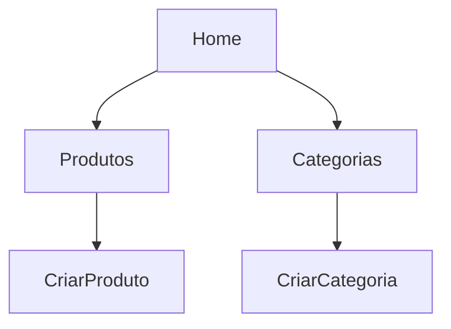
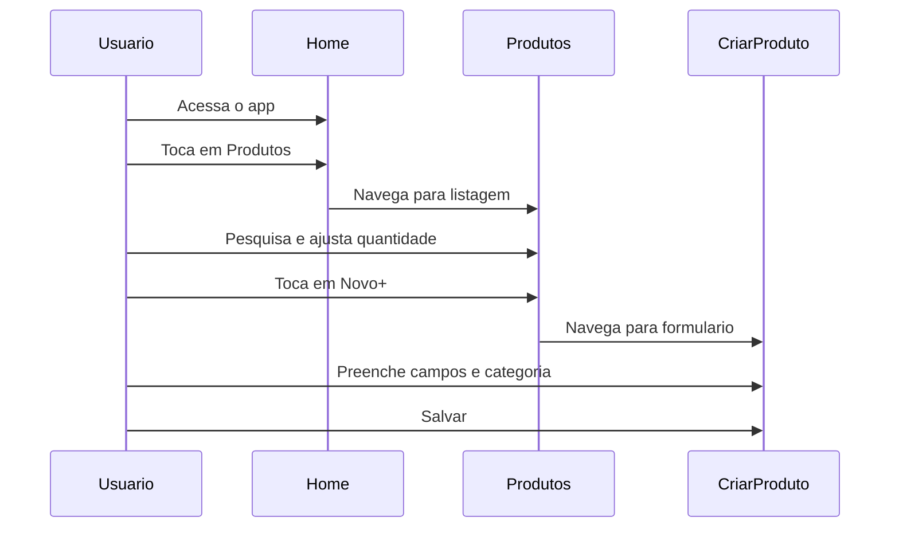

# IntegracaoSQL


Aplicativo mobile desenvolvido com Expo e React Native para gerenciamento de produtos e categorias, com navegacao tipada, interface minimalista padronizada e fluxo de cadastro/listagem organizado por modulos.

## Visao Geral

O projeto oferece uma estrutura clara para operacoes de catalogo com foco em usabilidade:

- Home com acesso direto aos modulos principais
- Gestao de produtos com busca e controle de quantidade
- Gestao de categorias com acoes de edicao e exclusao na listagem
- Formularios dedicados para cadastro de produto e categoria
- Dropdown para selecao de categoria no cadastro de produto

## Stack Tecnologica

- Expo 54
- React 19
- React Native 0.81
- TypeScript (modo strict)
- React Navigation Native Stack
- react-native-element-dropdown

## Arquitetura de Navegacao



## Fluxo Funcional



## Estrutura do Projeto

```text
integracaoSQL/
|-- App.tsx
|-- index.ts
|-- app.json
|-- package.json
|-- tsconfig.json
|-- assets/
|   |-- adaptive-icon.png
|   |-- favicon.png
|   |-- icon.png
|   |-- splash-icon.png
|-- src/
|   |-- screens/
|       |-- home/
|       |   |-- index.tsx
|       |-- produtos/
|       |   |-- index.tsx
|       |-- categorias/
|       |   |-- index.tsx
|       |-- criarProduto/
|       |   |-- index.tsx
|       |-- criarCategoria/
|           |-- index.tsx
```

## Modulos de Tela

| Tela | Papel no sistema |
|---|---|
| Home | Centraliza a navegacao entre Produtos e Categorias |
| Produtos | Lista produtos, filtra por nome e controla quantidade por item |
| Categorias | Lista categorias e exibe acoes de editar/excluir |
| CriarProduto | Formulario para nome, valor e categoria |
| CriarCategoria | Formulario para criacao de categoria |

## Padrao Visual

O app adota uma linha minimalista e consistente:

- Fundo claro neutro
- Cartoes com borda suave
- Botoes principais escuros com alto contraste
- Tipografia com hierarquia simples
- Campos de formulario alinhados e uniformes

## Configuracao e Execucao

### Requisitos

- Node.js LTS
- npm
- Expo Go no celular ou emulador Android/iOS

### Instalacao

```bash
npm install
```

### Execucao

```bash
npm run start
```

Comandos adicionais:

```bash
npm run android
npm run ios
npm run web
```

## Scripts

| Script | Comando |
|---|---|
| start | expo start |
| android | expo start --android |
| ios | expo start --ios |
| web | expo start --web |

## Qualidade Tecnica

- Tipagem de rotas com RootStackParamList
- TypeScript em strict mode
- Separacao por modulos de tela
- Organizacao de estilos por componente
